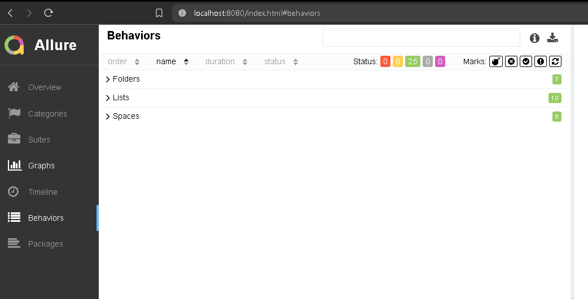

## Table of Contents

1. [Steps to execution the tests on Docker](#steps-to-execution-the-tests-on-docker)
2. [Historic](#historic)
   1. [Task 1: about the cURL tool (commited: 030324)](#task-1-about-the-curl-tool-commited-030324)
   2. [Task 2: Added basic CRUD for the Clickup application 'folder' API using the pytest module. (commited: 031724)](#task-2-added-basic-crud-for-the-clickup-application-folder-api-using-the-pytest-module-commited-031724)
      - [Requirements](#requirements)
      - [CRUD functionality](#crud-functionality)
      - [Additional functionality](#additional-functionality)
   3. [Task 3: allure report app support (commited: 040124)](#task-3-allure-report-app-support-commited-040124)
      - [Implement 3 endpoints of your API](#implement-3-endpoints-of-your-api)
   4. [Additional commit: (commited: 040524)](#additional-commit-commited-040524)
      - [Improvements and Bug Fixing](#improvements-and-bug-fixing)
   5. [Task 4: Clean Code and task 4 (commit: 041424)](#task-4-clean-code-and-task-4-commit-041424)
      - [Support:](#support)

## Steps to execution the tests on Docker

1. Navigate to the work directory:
   ``` cmd
   cd  D:\API_Automation_24
   ```
2. Build the Docker image:
   ``` cmd
   docker build -t pytest-auto-framework .
   OR
   docker build -t pytest-auto-framework -f Dockerfile_no_tests_run .
   ```
3. Wait for the image to finish building.
4. Connect to the Docker container:
   ``` cmd
   docker run -ti -p 8080:80 pytest-auto-framework bash
   ```
5. Execute the following commands inside the container: \
   **Note:** This steps must be executed if 'Dockerfile_no_tests_run' was used to build the image
   ``` cmd
   . env/bin/activate
   python3 -m pylint clickup_api/ --rcfile=.pylintrc
   python -m pytest clickup_api/ -v -s  --alluredir reports/allure/allure-results --clean-alluredir
   ```
6. Execute the following command to view the report on allure app
   ``` cmd 
   allure serve reports/allure/allure-results/ -p 80
   ```
7. Open the following URL in your web browser:
   ```html
      http://localhost:8080/index.html
   ```

## Historic:

### **Task 1:** about the cURL tool (commited: 030324)

### **Task 2:** Added basic CRUD for the Clickup application 'folder' API using the pytest module. (commited: 031724)

``` 
Requirements:
The .env file must contain the following kyes:
 - TOKEN=<A token generated for the 'clickup' app>
 - SPACE_ID=<a space ID created>
``` 

#### CRUD functionality

- Authentication
- Create folder
- Read folder
- Update folder
- Delete folder
- Cleanup

#### Additional functionality:

- Get all folders

### **Task 3:** allure report app support (commited: 040124)

1. Implement 3 endpoints of your API
    - Folders
    - Lists
    - Spaces
2. Reports in allure should be included
3. At least 2 functional tests should be included
    - Test that a folder with the same name cannot create
    - Test Space with this name already exists
    - Test Space not found
    - Test empty json input returns 400 error [List, Folder, Space]

#### Others things on the commits:

- Fix some issues found by pylint app
- Added response validation.
- Enhanced Spaces and Folders test cases.
- Updated and Enhanced rest_client.py and validate_response.py files.
- Added JSON files for validation.
- Included JSON payload for API requests.
- Improved rest_client and configuration.
- 
- 

### Additional commit: (commited: 040524)

#### Improvements and Bug Fixing

**Description:**

- Removed dependency of 'SPACE_ID' from the environment file
- Modified some functions to avoid the use of pytest.fixture in tests
- Added a test for tasks on the list endpoint
- Made several improvements to the folder, list, and space

### **Support:**

**Folders:** Get Folders, Create Folder, Get Folder, Update Folder, Delete Folder

**Lists:** Get Lists, Create List, Get Folderless Lists, Get List, Update List, Delete List, Add Task To List, Remove
Task From List

**Spaces:** Get Spaces, Create Space, Get Space, Update Space, Delete Space

### **Task 4:** Clean Code and task 4 (commit: 041424)

- Fixed some errors detected by the 'pylint' module
- .pylintrc file was added to run the module pylint
   ``` cmd
   command: pylint  clickup_api --rcfile=.pylintrc)
   ```
- Some unused files in the project were deleted and folders.
- Clean code and code refactoring
- Support to Docker and .dockerignore file added
- README.md file was updated